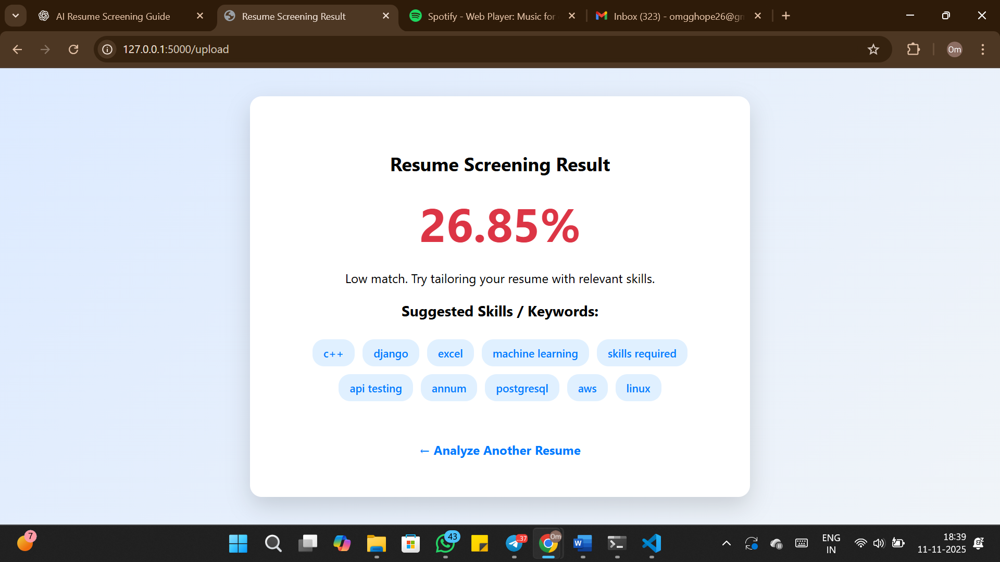

# AI Resume Screening Tool

A web application that analyzes a resume against a job description and calculates a similarity score. It also suggests missing skills required for the job, helping candidates optimize their resumes for better chances of selection.

---

## Features

- Upload Resume and Job Description in PDF format
- Extract text from PDFs using PyMuPDF
- Calculate similarity using TF-IDF and Cosine Similarity
- Suggest missing skills and programming languages required for the job
- Clean, user-friendly web interface built with Flask

---

## Screenshots

**Upload Page:**  


**Result Page:**  


---

## Installation

1. Clone the repository:
   ```bash
   git clone https://github.com/omghope/AI-Resume-Screening.git
